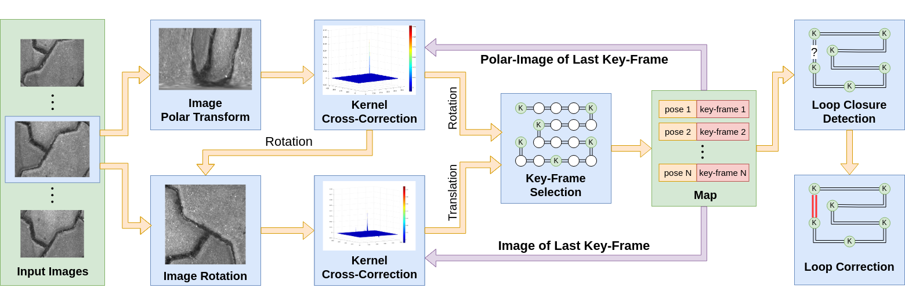
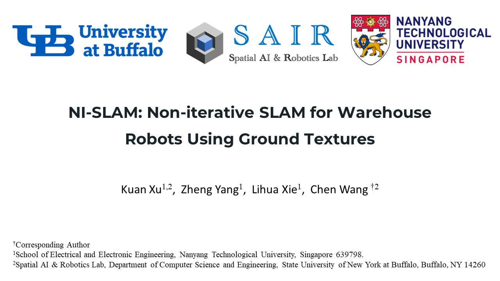
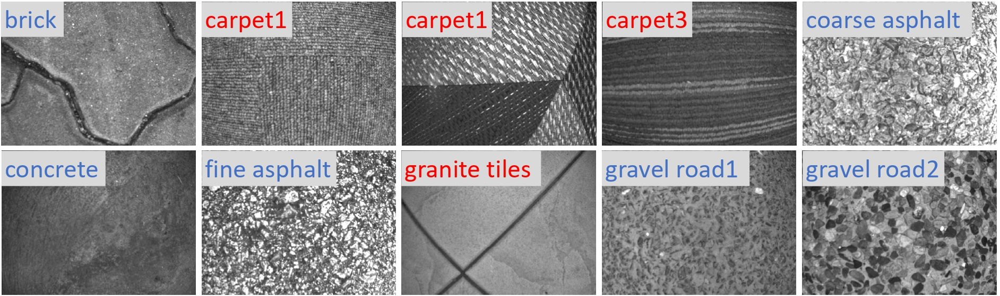
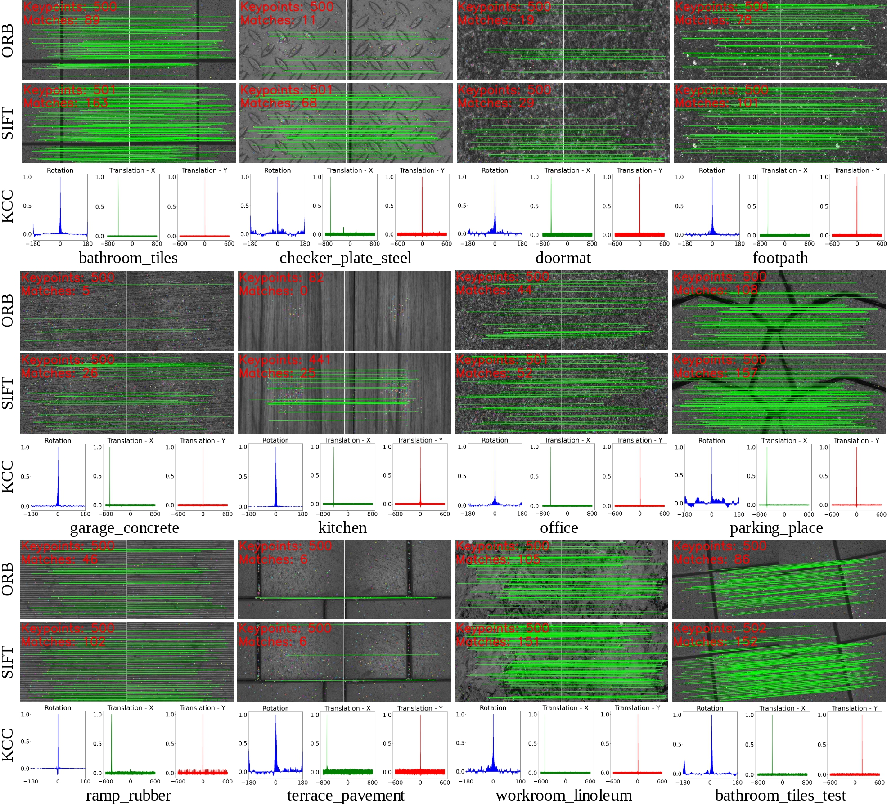
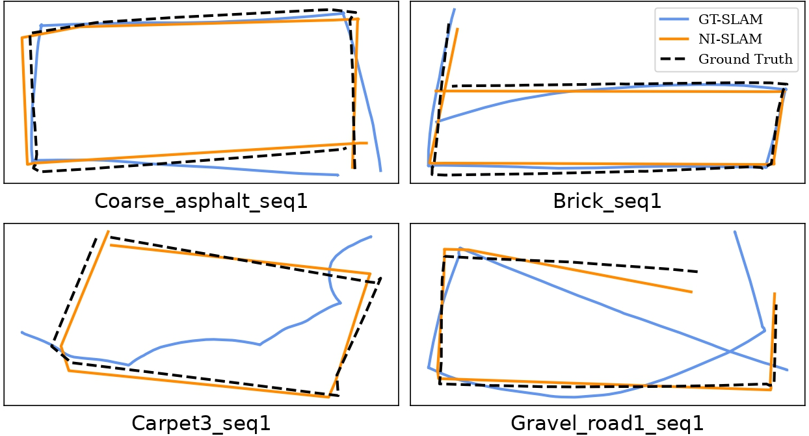
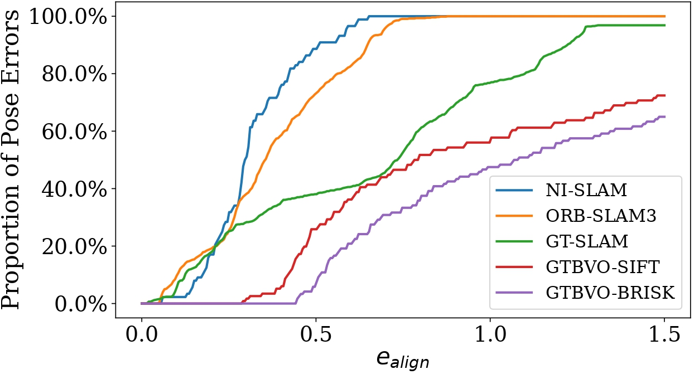
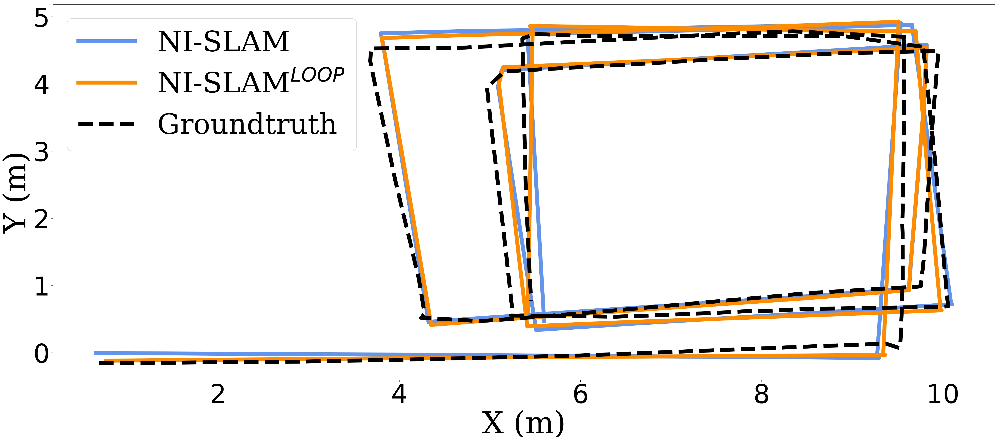
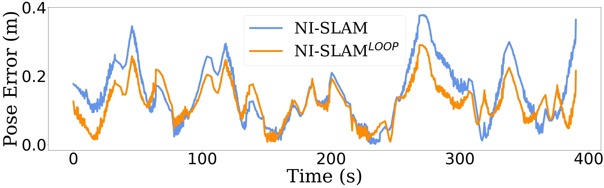

# NI-SLAM
## Non-iterative SLAM for Warehouse Robots Using Ground Textures

 

NI-SLAM is a novel **non-iterative, ground-texture-based** visual SLAM system for **the warehouse robot**, which includes non-iterative visual odometry, loop closure detection and map reuse. Our system can provide robust localization in **dynamic** and **large-scale** environments **using only a monocular camera**. Especially, a **kernel cross-correlator** has been proposed to estimate the translation and rotation between two images. Compared with the traditional motion estimation methods that use feature detection, matching and nonlinear optimization, it is non-iterative and has a **closed-form solution**, hence it is very efficient and can run in real-time while consuming few computing resources. Besides, as being the **image-level registration**, it is more **robust** and **accurate** when dealing with ground images with **few textures** or with many **repetitive patterns** than the feature-based methods.

**Authors:** [Kuan Xu](https://github.com/xukuanHIT), [Zheng Yang](https://github.com/yangzheng-yz), [Lihua Xie](https://personal.ntu.edu.sg/elhxie/), and [Chen Wang](https://chenwang.site/)

**Video:**

<a href="https://www.youtube.com/watch?v=SbzFBEgfazQ" target="_blank"></a>


## Related Papers

**Non-iterative SLAM for Warehouse Robots Using Ground Textures**, Kuan Xu, Zheng Yang, Lihua Xie, Chen Wang, *arXiv preprint arXiv:1710.05502*, 2023. **[PDF](https://arxiv.org/pdf/1710.05502.pdf)** 


**Kernel Cross-Correlator**, Chen Wang, Le Zhang, Lihua Xie, Junsong Yuan, *AAAI Conference on Artificial Intelligence (AAAI)*, 2018. **[PDF](https://arxiv.org/pdf/1709.05936.pdf)** 


**Correlation Flow: Robust Optical Flow Using Kernel Cross-Correlators**, Chen Wang, Tete Ji, Thien-Minh Nguyen, Lihua Xie. *International Conference on Robotics and Automation (ICRA)*, 2018. **[PDF](https://arxiv.org/pdf/1802.07078.pdf)**


**Non-iterative SLAM**, Chen Wang, Junsong Yuan, and Lihua Xie, *International Conference on Advanced Robotics (ICAR)*, 2017. **[PDF](https://arxiv.org/pdf/1701.05294.pdf)**


If you use NI-SLAM or GeoTracking dataset, please cite:

```bibtex
@article{xu2023non,
  title={Non-iterative SLAM for Warehouse Robots Using Ground Textures},
  author={Xu, Kuan and Yang, Zheng and Xie, Lihua and Wang, Chen},
  journal={arXiv preprint arXiv:1710.05502},
  url={https://arxiv.org/pdf/1710.05502},
  video={https://youtu.be/SbzFBEgfazQ},
  code={https://github.com/sair-lab/ni-slam},
  year={2023},
}

@inproceedings{wang2018kernel,
  title = {Kernel Cross-Correlator},
  author = {Wang, Chen and Zhang, Le and Xie, Lihua and Yuan, Junsong},
  booktitle = {Thirty-Second AAAI Conference on Artificial Intelligence (AAAI)},
  pages = {4179--4186},
  year = {2018},
  url = {https://arxiv.org/pdf/1709.05936},
  code = {https://github.com/sair-lab/KCC},
}

@inproceedings{wang2018correlation,
  title = {Correlation Flow: Robust Optical Flow Using Kernel Cross-Correlators},
  author = {Wang, Chen and Ji, Tete and Nguyen, Thien-Minh and Xie, Lihua},
  booktitle = {2018 International Conference on Robotics and Automation (ICRA)},
  pages = {836--841},
  year = {2018},
  url = {https://arxiv.org/pdf/1802.07078},
  code = {https://github.com/sair-lab/correlation_flow},
}

@inproceedings{wang2017non,
  title = {Non-iterative SLAM},
  author = {Wang, Chen and Yuan, Junsong and Xie, Lihua},
  booktitle = {International Conference on Advanced Robotics (ICAR)},
  pages = {83--90},
  year = {2017},
  organization = {IEEE},
  url = {https://arxiv.org/pdf/1701.05294},
  video = {https://youtu.be/Ed_6wYIKRfs},
  addendum = {Best Paper Award in Robotic Planning},
}
```

## Test Environment
### Dependencies
* OpenCV 4.2
* Eigen 3
* Ceres 2.0.0 
* FFTW3
* ROS noetic
* Boost
* yaml-cpp
* VTK

## Build
```
    cd ~/catkin_ws/src
    git clone https://github.com/sair-lab/NI-SLAM.git
    cd ../
    catkin_make
    source ~/catkin_ws/devel/setup.bash
```

## Run 

Modify the configuration file in [configs](configs) and then run

```
rosrun ni_slam ni_slam src/kcc_slam/configs/your_config.yaml
```

## Data

### GeoTracking Dataset

 


Our data collection platform is a modified Weston SCOUT Robot. The robot is equipped with an IDS uEye monocular camera, which is positioned at the bottom and facing downward, placed at a height of 0.1m above the ground. To ensure constant illumination, a set of LED lights are arranged around the camera. For ground truth, a prism is installed on the top of the robot, and its position is tracked by a Leica Nova MS60 MultiStation laser tracker.

We collect the data of 10 common ground textures, including 6 $\color{lightblue}{outdoor}$ textures and 4 $\color{red}{indoor}$ textures. The table below provides detailed information and download links for each sequence. The camera parameters can be found [here](https://entuedu-my.sharepoint.com/:u:/g/personal/kuan_xu_staff_main_ntu_edu_sg/EQqXW2eDcXNAkBWlSGgq6bgBe2yYdjdcuSJ8HEFey3haGg?e=nOg2ym).

  <!-- <div align=center> -->
  
  
Sequence Name|Total Size|Length|Download Link
--|:--|:--|:--:
Brick_seq1|1.0g|14m|[Link](https://entuedu-my.sharepoint.com/:u:/g/personal/kuan_xu_staff_main_ntu_edu_sg/EUMENxrPbQBFmzAQmfhMw4YB4df6_uq6ua7H1fo9A7NC7g?e=5Mzy9Q)
Brick_seq2|0.9g|25m|[Link](https://entuedu-my.sharepoint.com/:u:/g/personal/kuan_xu_staff_main_ntu_edu_sg/EY1-hFr2taZJqjxE4k6-W6oB-XenzRAk_RW8DME6VvqUmg?e=PSQEi6)
Carpet1_seq1|1.7g|43m|[Link](https://entuedu-my.sharepoint.com/:u:/g/personal/kuan_xu_staff_main_ntu_edu_sg/ETuQX1ePORdKmQJ_wFXT1mUBS6MqJ3LoZ-eeUsDhhXouug?e=AmMgBX)
Carpet1_seq2|1.7g|38m|[Link](https://entuedu-my.sharepoint.com/:u:/g/personal/kuan_xu_staff_main_ntu_edu_sg/EQwzCVxFMT1Hh9BMMNljwSgBM27RXd7v8gdM3KMNWm5mDQ?e=aSoH1v)
Carpet2_seq1|3.0g|41m|[Link](https://entuedu-my.sharepoint.com/:u:/g/personal/kuan_xu_staff_main_ntu_edu_sg/EZ6Y6xsmk6xBjkkU7JNrVQIB_zTovWY8-AOPdW7AN7XJLw?e=GvlK03)
Carpet3_seq1|0.7g|17m|[Link](https://entuedu-my.sharepoint.com/:u:/g/personal/kuan_xu_staff_main_ntu_edu_sg/EXxxHyPOvsFBh8judFQqhtEB-kI6uBzFmKcCiNDZZBzBIw?e=917b5c)
Carpet3_seq2|0.7g|19m|[Link](https://entuedu-my.sharepoint.com/:u:/g/personal/kuan_xu_staff_main_ntu_edu_sg/EQHoNL0xtpdKj6e6mhBBLyEBl-7s5N0cJ6U47jzT1tJheg?e=ot4hSH)
Carpet3_seq3|1.0g|45m|[Link](https://entuedu-my.sharepoint.com/:u:/g/personal/kuan_xu_staff_main_ntu_edu_sg/EcE3o-HN0UJEpc57_EJM3kcBSVSIQ8M7oCjkWsZlUQRKLw?e=qG8MUM)
Coarse_asphalt_seq1|1.2g|16m|[Link](https://entuedu-my.sharepoint.com/:u:/g/personal/kuan_xu_staff_main_ntu_edu_sg/EQbDBVemPH9Cp7bqV2ZwfFIBD_gsHQ-d3atPfSY8__6DKQ?e=ASludI)
Concrete_seq1|1.0g|23m|[Link](https://entuedu-my.sharepoint.com/:u:/g/personal/kuan_xu_staff_main_ntu_edu_sg/EcIYh8RIhClKs7ogwgFmS_QBlflxcx-eR33BwRVerNXFgg?e=8McLDA)
Concrete_seq2|0.9g|24m|[Link](https://entuedu-my.sharepoint.com/:u:/g/personal/kuan_xu_staff_main_ntu_edu_sg/EbNJ5FdpQSJMqK-2zyoEPNoBNCO4ZzhuzjzTL2m1AYZQKQ?e=feQNUX)
Fine_asphalt_seq1|1.1g|22m|[Link](https://entuedu-my.sharepoint.com/:u:/g/personal/kuan_xu_staff_main_ntu_edu_sg/EY22RWOcM89ApAYEr0E5I5EB6QhINnL5iGsbgli8INjuXg?e=HArfqb)
Fine_asphalt_seq2|1.3g|28m|[Link](https://entuedu-my.sharepoint.com/:u:/g/personal/kuan_xu_staff_main_ntu_edu_sg/ERBTClOvkpBHgNeAEc5co4sBI5E-ubQ2MqNFwlfys07mbQ?e=WDd0uP)
Granite_tiles_seq1|1.2g|27m|[Link](https://entuedu-my.sharepoint.com/:u:/g/personal/kuan_xu_staff_main_ntu_edu_sg/ERNkKMy_nvFFmORT7LU_MxEB7TDzhAsNKEEfBf_cNG4Zbg?e=sjDkYW)
Granite_tiles_seq2|1.6g|41m|[Link](https://entuedu-my.sharepoint.com/:u:/g/personal/kuan_xu_staff_main_ntu_edu_sg/EU-8ocb82WZDpErJuOGfR6oBbQwXEpAzR-nykA6wXk9zeg?e=Vx4P1t)
Gravel_road1_seq1|0.8g|18m|[Link](https://entuedu-my.sharepoint.com/:u:/g/personal/kuan_xu_staff_main_ntu_edu_sg/ERRQQR0VTCVEqSdo9pM85zwBNMQFRBcgev4VVIZtjg68Vg?e=KFxJST)
Gravel_road2_seq1|2.1g|46m|[Link](https://entuedu-my.sharepoint.com/:u:/g/personal/kuan_xu_staff_main_ntu_edu_sg/EZS9BNL-ct1Nu3_Ag1Z0YuIBt6ah02i8vojro4eHexs4ww?e=hQOLIF)
  <!-- </div> -->

### Run with Your Data

The data should be organized in the following format:
```
dataroot
├── image_names.txt
├── rgb
│   ├── 00001.png
│   ├── 00002.png
│   ├── 00003.png
│   └── ......
└── times.txt
```
where `image_names.txt` contains the image names in `/dataroot/rgb` and `times.txt` contains the corresponding double type timestamps. 

## Experiments

### Data Association

 

We compare the data association of our system with ORB and SIFT on the HD Ground dataset. The numbers of features and matching inliers are given. For the KCC, the correction results are projected to three coordinate axes and represent the estimation of the 3-DOF movement. The vertical axis is the confidence of estimated movement on the horizontal axis. The higher the value of the peak relative to other positions, the greater the confidence of motion estimation. The results show that the data association of KCC is more stable for various ground texture images.

### Visual Odometry
<div style="display:flex; justify-content:flex-start;">
    
    
</div>

This experiment is conducted on the GeoTracking dataset. The left figure shows the trajectories produced by our system and GT-SLAM on 4 sequences. The right figure provides the comparison of error distributions of different systems on the Gravel_road2_seq1 sequence, where the vertical axis is the proportion of pose errors that are less than the given error threshold on the horizontal axis.

### Loop Closure

<div style="display:flex; justify-content:flex-start;">
    
    
</div>

These two figures show the performance difference of NI-SLAM with and without loop correction on the Fine_asphalt_seq2 sequence. It is seen that the pose errors are significantly decreased after the loop correction.


